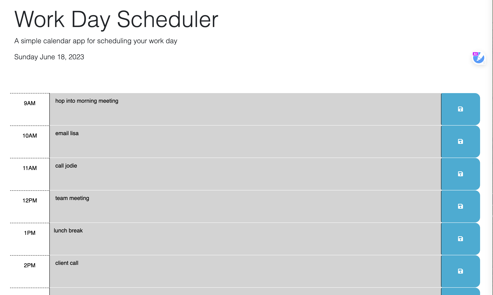

# hw5-work day scheduler

## Description

This project creates a schedule for the user to block out how they are spending their work day. Enter your tasks into the task blocks and click save to log them into the scheduler. The grey blocks represent time the has already passed, the red block represents the current time, and the green block represent upcoming hours.

## Table of Contents

- [Installation](#installation)
- [Usage](#usage)
- [Credits](#credits)
- [License](#license)

## Installation

This project uses Bootstrap to organize the layout and is powered by Day.js abd jQuery. None of these installations are required by the user.

You can view the deployed page here: https://laurenmiller389.github.io/hw5-workday/

## Usage

Simply click the deployment link above to get started. Find the specified hours to the left and type in your tasks accordingly. Click the blue button to the right to save.

## Credits

Columbia University Coding Bootcamp

## License

MIT License

## How to Contribute

Keep tabs on the [Contributor Covenant](https://www.contributor-covenant.org/)!

## Tests

No testing is required for this application/